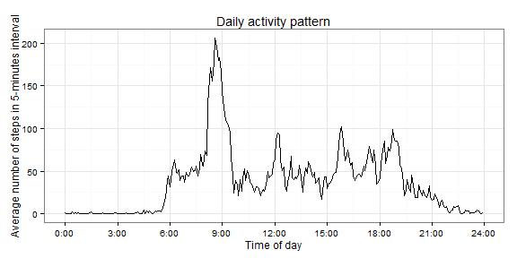

# Reproducible reserch: Peer Assessment 1

I set globally echo parameter to TRUE what makes that all code chunks are visible:


```r
opts_chunk$set(echo = TRUE)
Sys.setlocale("LC_TIME", "English")
```

```
## [1] "English_United States.1252"
```

## Loading and preprocessing the data

- Load the data  


```r
library(lubridate)
library(dplyr)
library(ggplot2)

fileurl <- "https://d396qusza40orc.cloudfront.net/repdata%2Fdata%2Factivity.zip"
temp <- tempfile()
download.file(fileurl, temp, mode="wb", method="auto")
unzip(temp, "activity.csv")
dt <- read.table("activity.csv", sep=",", header=T)
```

- Process/transform the data (if necessary) into a format suitable for your analysis

I transform interval data from  the format "hhmm" into minutes that passed since the beginning of the day. Now intervals are spread evenly.


```r
dt$date <- ymd(dt$date)
dt$interval<- 60 * (dt$interval %/% 100) + dt$interval %% 100 
```
## What is mean total number of steps taken per day?

- Calculate the total number of steps taken per day


```r
totalSteps <- dt %>% 
              na.omit() %>%
              group_by(date) %>% 
              summarise(ts = sum(steps, na.rm = TRUE))
```

- Calculate and report the mean and median of the total number of steps taken per day


```r
mean <- mean(totalSteps$ts)
mean
```

```
## [1] 10766.19
```

```r
median <- median(totalSteps$ts)
median
```

```
## [1] 10765
```

- Make a histogram of the total number of steps taken each day


```r
ggplot(data = totalSteps, aes(ts)) + 
    geom_histogram(col = "black", 
                   fill = "royalblue",
                   binwidth = 500) + 
    labs(title = "Histogram of numbers of steps per day") +
    labs(x = "Number of steps", y = "Count") +
    geom_vline(xintercept = mean, colour = "green", linetype = "solid", size = 1.2) +
    geom_vline(xintercept = median, colour = "red", linetype = "dashed", size = 1.2) +
    annotate("text", x = mean, y = 10, label = "Mean",hjust = 1) +
    annotate("text", x = median, y = 10, label = "Median",hjust = -0.1) +
    theme_bw() 
```

 

## What is the average daily activity pattern?

- Make a time series plot (i.e. type = "l") of the 5-minute interval (x-axis) and the average number of steps taken, averaged across all days (y-axis)


```r
meanSteps <- dt %>% 
    na.omit() %>%
    group_by(interval) %>% 
    summarise(ms = mean(steps, na.rm = TRUE)) %>%
    arrange(desc(interval))

ggplot(data = meanSteps, aes(x = interval, y = ms)) + geom_line() + 
    scale_x_continuous(breaks = 0:8 * 180, labels=paste(0:8 * 3,":00", sep = "")) +
    labs(title = "Daily activity pattern") +
    labs(x = "Time of day", y = "Average number of steps in 5-minutes interval") +
    theme_bw() 
```

 

- Which 5-minute interval, on average across all the days in the dataset, contains the maximum number of steps?


```r
maxAvgAt <- meanSteps[which.max(meanSteps$ms),]$interval
paste0(maxAvgAt %/% 60, ":" , maxAvgAt %% 60)
```

```
## [1] "8:35"
```

## Imputing missing values

- Calculate and report the total number of missing values in the dataset (i.e. the total number of rows with NAs)


```r
sum(is.na(dt$steps))
```

```
## [1] 2304
```


```r
imputeDt <- transform(dt, 
                     steps=ifelse(is.na(steps), 
                                  meanSteps$ms, 
                                  steps))
```

- Devise a strategy for filling in all of the missing values in the dataset.

For filling the missing values I have used the mean for that 5-minute interval.

- Create a new dataset that is equal to the original dataset but with the missing data filled in.


```r
imputeTotalSteps <- imputeDt %>% 
    group_by(date) %>% 
    summarise(ts = sum(steps, na.rm = TRUE))
```

- Calculate and report the mean and median total number of steps taken per day


```r
imputeMean <- mean(imputeTotalSteps$ts)
imputeMean
```

```
## [1] 10766.19
```

```r
imputeMedian <- median(imputeTotalSteps$ts)
imputeMedian
```

```
## [1] 10766.19
```

The means reamain the same and there was slight change in meadian

- Make a histogram of the total number of steps taken each day


```r
ggplot(data = imputeTotalSteps, aes(ts)) + 
    geom_histogram(col = "black", 
                   fill = "royalblue",
                   binwidth = 500) + 
    labs(title = "Histogram of numbers of steps per day with missing values imputed") +
    labs(x = "Number of steps", y = "Count") +
    geom_vline(xintercept = mean, colour = "green", linetype = "solid", size = 1.2) +
    geom_vline(xintercept = median, colour = "red", linetype = "dashed", size = 1.2) +
    annotate("text", x = imputeMean, y = 10, label = "Mean",hjust = 1) +
    annotate("text", x = imputeMedian, y = 10, label = "Median",hjust = -0.1) +
    theme_bw() 
```

 

## Are there differences in activity patterns between weekdays and weekends?

- Create a new factor variable in the dataset with two levels – “weekday” and “weekend” indicating whether a given date is a weekday or weekend day.


```r
imputeDt$week <- factor(weekdays(imputeDt$date) %in% c("Saturday","Sunday"), 
                 labels=c("weekday","weekend"), ordered=FALSE)

imputeMeanSteps <- imputeDt %>% 
    group_by(interval, week) %>% 
    summarise(ms = mean(steps, na.rm = TRUE))
```

- Make a panel plot containing a time series plot (i.e. type = "l") of the 5-minute interval (x-axis) and the average number of steps taken, averaged across all weekday days or weekend days (y-axis).


```r
ggplot(data = imputeMeanSteps, aes(x = interval, y = ms)) + geom_line() + 
    scale_x_continuous(breaks = 0:8 * 180, labels=paste(0:8 * 3,":00", sep = "")) +
    facet_grid(week ~ .) +
    labs(title = "Daily activity pattern") +
    labs(x = "Time of day", y = "Average number of steps in 5-minutes interval") +
    theme_bw() 
```

 
